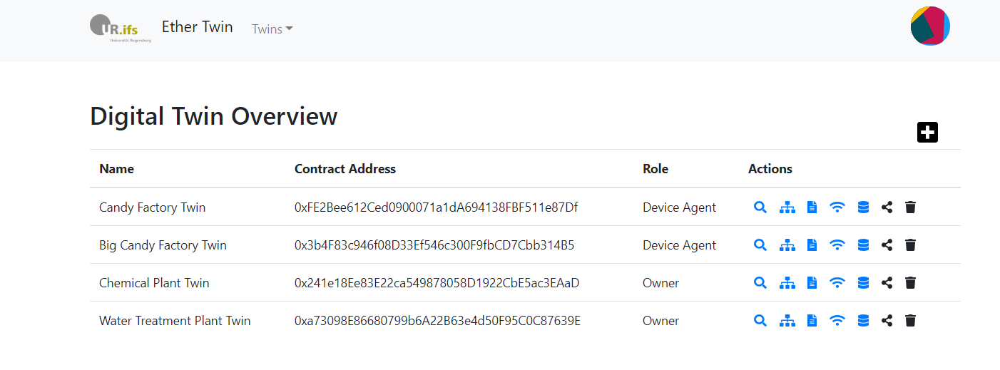

# ethertwin
The **ethertwin** prototype orginates from a research approach to share digital twin data over its lifecycle.
To allow the participation of the multiple lifecycle parties without relying on trusted third parties (TTPs), **ethertwin** relies on a distributed approach by integrating the [Ethereum](ethereum.org) blockchain and the distributed hash table (DHT) [Swarm](swarm.ethereum.org).
On the basis of [AutomationML](https://www.automationml.org/) (AML) files that specify assets, a digital twin can be created and shared with the twin's lifecycle parties.
The **ethertwin** prototype allows to:
- create digital twins
- share each twin  
- upload documents
- update twin specification and documents (versioning)
- create sensor data feeds
- control access of users by lifecycle roles and asset attributes
- list asset components (specification parsing)

## Project setup
```
npm install
```

### Prerequisites

Download [Parity](https://github.com/paritytech/parity-ethereum/releases) to set up your Ethereum blockchain. Create a folder `network`, add the `parity.exe` and `password.txt`.
Then run the following console command in the `network` folder to start your blockchain:
```
parity --config dev --unlock "0x00a329c0648769a73afac7f9381e08fb43dbea72" --password .\password.txt --unsafe-expose --jsonrpc-cors=all
```

Download [Swarm](https://swarm.ethereum.org/downloads/) to set up the DHT. 
Then run the following console command:
```
swarm --bzzaccount <accountAddress> --config ./config.toml --datadir . --httpaddr=0.0.0.0 --corsdomain '*' --password password.txt```
```

Install [Truffle](https://github.com/trufflesuite/truffle) to initialize the Smart Contracts:
```
npm -i truffle
truffle migrate --network parity
```

### Configuration
Add `config.json` with the corresponding values (IP) for the Swarm DHT etc.
Note that the values for the `registry` and `authorization` are optional:
```
{
  "swarm": "http://<IP>:5000",
  "ethereum": {
    "rpc": "ws://<IP>:8546",
    "registry": "<RegistryContractAddress>",
    "authorization": "<AuthorizationContractAddress>"
  }
}
```

### Compilation
Compiles and hot-reloads for development
```
npm run serve
```

Compiles and minifies for production
```
npm run build
```

## Usage
An exemplary specification for the twin creation can be found at `misc/CandyFactory.aml`, which originates from the [CPS Twinning](https://github.com/sbaresearch/cps-twinning) prototype. 
Various screenshots showing the **ethertwin** prototype functionality can be found at `misc/Screenshots`. The following screenshot illustrates the Home site of our
**ethertwin** prototype - showing  all twins of the user.



## Research and Citation
Please consider citing our [publication introducing the theoretical concept](https://link.springer.com/chapter/10.1007/978-3-030-22479-0_15) 
if you are using our **ethertwin** prototype for your research. 